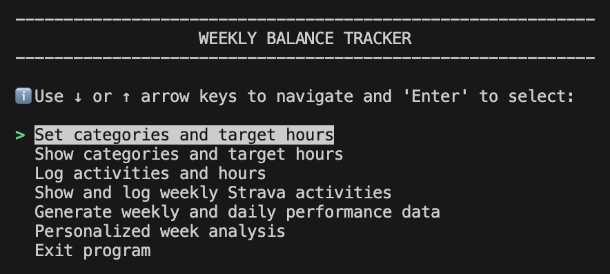
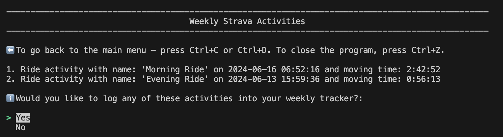
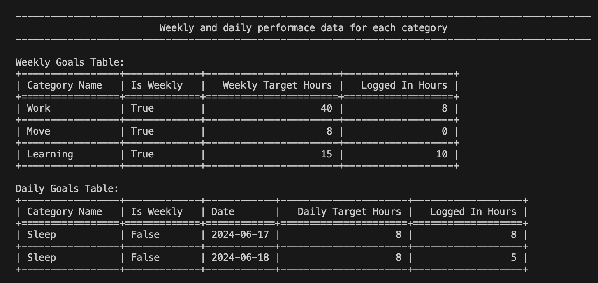
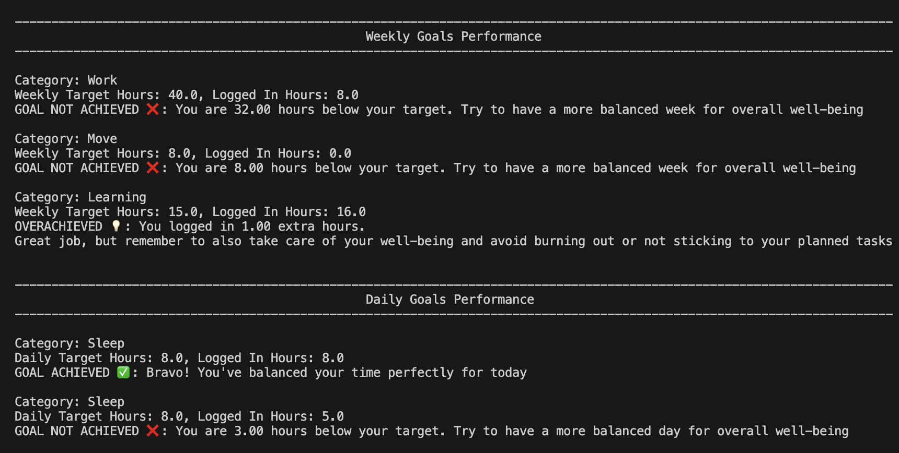

# Balanced Week Tracker

Balanced Week Tracker - a Python application that helps you track the time spent on various daily activities to achieve a balanced week.
Ever wondered about trying the 8/8/8 perfect day formula? Let's track your progress for each daily or weekly activity such as sleep, work, exercise, learning, and anything else you like! Then you can check your progress and receive a detailed performance analysis with feedback on how your week went. 

The application integrates with the [Strava API](https://developers.strava.com/docs/reference/) to fetch activities directly from Strava, making it easier to log and analyze your fitness data.

## Features

All features are accessible via the menu options in the application:

  

- **Set Categories and Target Hours**: Allows users to set categories of activities and specify target hours for each. Users can choose whether the targets are daily or weekly. For example, you can set the category "Sleep" with a daily target of 8 hours and "Learning" with a weekly target of 4 hours.
- **Show Categories and Target Hours**: Displays a list of all categories along with their target hours, serving as personal goals for the week.
- **Log Activities and Hours**: Users can record the time spent on various activities per category and date. For example, you can log 1 hour of "Learning" on Monday and 2 hours of "Sleep" on Tuesday.
- **Show Weekly Strava Activities**: Fetches weekly activities from the Strava API and displays them for the user to optionally log and categorize in the tracker. For example, if you ran 10 km on Monday, the application will ask if you want to log this activity and in which category. To enable Strava integration, you need to provide your Strava API access token in a `.env` file. [How to get the access token](https://developers.strava.com/docs/authentication/)

  

- **Generate Weekly and Daily Performance Data**: Retrieves and displays two tables of data: one showing the total hours logged per category for the weekly goals and another showing the total hours logged per category for the daily goals.

  

- **Personalized Week Analysis**: Compares logged hours against target hours for each category, offering a summary and actionable feedback on whether daily or weekly goals are being met.

  

- **Exit Program**: Allows users to exit the application.

## Getting started

1. To install the required dependencies, navigate to the project folder and run:

    `pip install -r requirements.txt`

2. To start the application, run:
    
    `python main.py`

## To run unit tests

1. `pytest`
